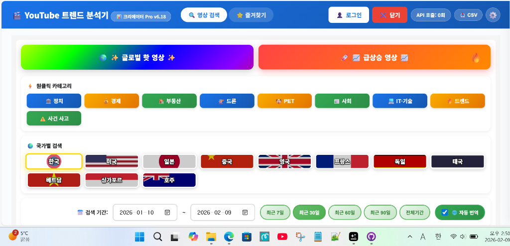
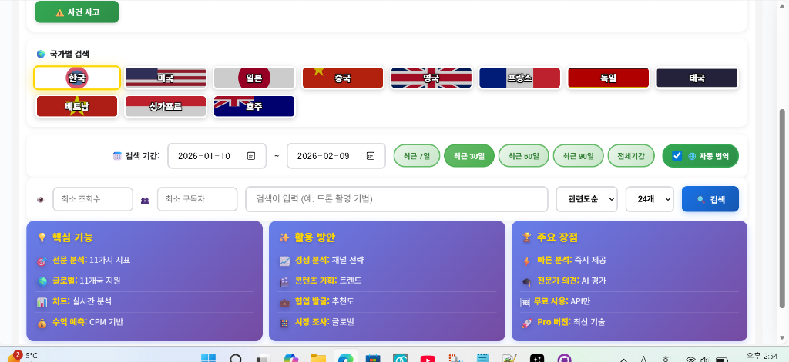
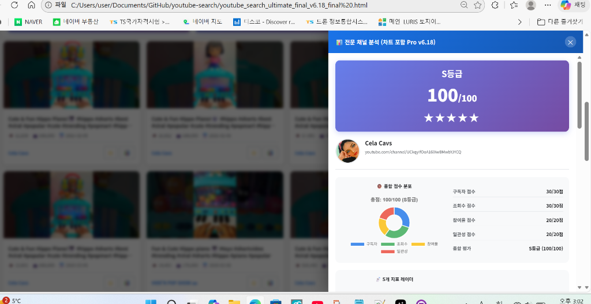

# 📸 스크린샷 업로드 가이드

## ✅ 완료된 작업

1. ✅ **README.md 업데이트 완료** (스크린샷 섹션 추가)
2. ✅ **스크린샷 파일명 정의 완료**
3. ✅ **폴더 구조 설계 완료**

---

## 📁 필요한 폴더 구조

GitHub 저장소에 다음과 같은 폴더 구조를 만드세요:

```
youtube-search/
├── README.md (업데이트된 파일)
├── docs/
│   └── screenshots/
│       ├── 01-main-screen.png
│       ├── 02-search-options.png
│       ├── 03-search-results.png
│       └── 04-channel-analysis.png
```

---

## 📥 스크린샷 파일 준비

### **캡처된 이미지 4장:**

| 번호 | 파일명 | 설명 | 원본 URL |
|------|--------|------|----------|
| 1 | `01-main-screen.png` | 메인 화면 (상단 UI) | https://www.genspark.ai/api/files/s/yMznqSt0 |
| 2 | `02-search-options.png` | 검색 옵션 & 정보 카드 | https://www.genspark.ai/api/files/s/ddVB4aw8 |
| 3 | `03-search-results.png` | 24개 영상 검색 결과 | https://www.genspark.ai/api/files/s/u4n4eINp |
| 4 | `04-channel-analysis.png` | 채널 분석 팝업 (S등급) | https://www.genspark.ai/api/files/s/GUJ03R11 |

---

## 🚀 업로드 방법

### **방법 1: GitHub Desktop (추천)**

#### **1단계: 폴더 생성**

로컬 저장소에서 폴더 생성:
```
C:\Users\...\문서\GitHub\youtube-search\docs\screenshots\
```

#### **2단계: 스크린샷 다운로드**

각 URL에서 이미지 다운로드:

1. **01-main-screen.png**
   - https://www.genspark.ai/api/files/s/yMznqSt0
   - 브라우저로 열기 → 우클릭 → 다른 이름으로 저장
   - 파일명: `01-main-screen.png`

2. **02-search-options.png**
   - https://www.genspark.ai/api/files/s/ddVB4aw8
   - 파일명: `02-search-options.png`

3. **03-search-results.png**
   - https://www.genspark.ai/api/files/s/u4n4eINp
   - 파일명: `03-search-results.png`

4. **04-channel-analysis.png**
   - https://www.genspark.ai/api/files/s/GUJ03R11
   - 파일명: `04-channel-analysis.png`

#### **3단계: 파일 복사**

다운로드한 4장의 이미지를 다음 경로로 복사:
```
C:\Users\...\문서\GitHub\youtube-search\docs\screenshots\
```

#### **4단계: README.md 업데이트**

새로운 README.md 파일을 다운로드하여 교체:
- 다운로드: `README_v2_with_screenshots.md`
- 파일명 변경: `README.md`
- 경로: `C:\Users\...\문서\GitHub\youtube-search\README.md`

#### **5단계: GitHub Desktop에서 Commit**

1. GitHub Desktop 열기
2. 변경사항 확인:
   - ✅ README.md (modified)
   - ✅ docs/screenshots/01-main-screen.png (new)
   - ✅ docs/screenshots/02-search-options.png (new)
   - ✅ docs/screenshots/03-search-results.png (new)
   - ✅ docs/screenshots/04-channel-analysis.png (new)
3. Summary 입력:
   ```
   docs: Add screenshots to README
   ```
4. Description (선택):
   ```
   - 메인 화면 스크린샷 추가
   - 검색 옵션 및 정보 카드 추가
   - 영상 검색 결과 추가
   - 채널 분석 팝업 추가
   ```
5. **Commit to main** 클릭
6. **Push origin** 클릭

---

### **방법 2: GitHub 웹 업로드**

#### **1단계: 폴더 생성**

1. https://github.com/pumping365/youtube-search 접속
2. **Add file** → **Create new file** 클릭
3. 파일명 입력:
   ```
   docs/screenshots/.gitkeep
   ```
4. **Commit new file** 클릭

#### **2단계: 이미지 업로드**

1. `docs/screenshots/` 폴더로 이동
2. **Add file** → **Upload files** 클릭
3. 4장의 이미지 드래그 앤 드롭:
   - 01-main-screen.png
   - 02-search-options.png
   - 03-search-results.png
   - 04-channel-analysis.png
4. Commit 메시지:
   ```
   docs: Add screenshots
   ```
5. **Commit changes** 클릭

#### **3단계: README.md 업데이트**

1. 저장소 루트로 이동
2. `README.md` 클릭
3. 연필 아이콘 (Edit) 클릭
4. 전체 내용을 새 README.md 내용으로 교체
5. Commit 메시지:
   ```
   docs: Update README with screenshots
   ```
6. **Commit changes** 클릭

---

## ✅ 업로드 후 확인사항

### **1. 파일 구조 확인**

GitHub 웹에서 확인:
```
✅ README.md
✅ docs/screenshots/01-main-screen.png
✅ docs/screenshots/02-search-options.png
✅ docs/screenshots/03-search-results.png
✅ docs/screenshots/04-channel-analysis.png
```

### **2. README.md 표시 확인**

저장소 메인 페이지에서:
- ✅ 스크린샷 섹션이 보이는가?
- ✅ 4장의 이미지가 정상 표시되는가?
- ✅ 이미지 설명이 표시되는가?

### **3. 이미지 링크 확인**

각 이미지를 클릭하여:
- ✅ 고화질 이미지가 표시되는가?
- ✅ 깨진 이미지 아이콘이 없는가?

---

## 🎨 README.md 스크린샷 섹션 미리보기

```markdown
## 📸 스크린샷

### 1️⃣ 메인 화면


**주요 기능:**
- 🌈 글로벌 핫 영상 & 급상승 영상 원클릭 버튼
- 🎯 9가지 원클릭 카테고리
- 🌍 11개국 선택
- 📅 검색 기간 설정
- 🔍 고급 검색 옵션

---

### 2️⃣ 검색 옵션 & 정보 카드


**3가지 핵심 정보:**
- 📍 핵심 기능: 11가지 지표
- ✨ 활용 방안: 경쟁 분석, 트렌드 기반
- 🎁 주요 장점: 빠른 분석, 전문가 작성

---

### 3️⃣ 검색 결과 (24개 영상 카드)


**영상 카드 정보:**
- 🖼️ 썸네일: 고화질 영상 미리보기
- 📝 제목: 영상 제목
- 👁️ 조회수: 영상 조회수
- ⭐ 즐겨찾기: 영상 저장 버튼
- 📊 채널 분석: 심층 분석 팝업

---

### 4️⃣ 채널 분석 팝업 (전문 지표)


**종합 분석 결과:**
- 🏆 S등급 100/100: 최고 등급 채널
- ⭐⭐⭐⭐⭐ 별점 5점: 완벽한 채널

**4종 차트 시각화:**
- 🍩 도넛 차트: 종합 점수
- 🕸️ 레이더 차트: 5개 지표 비교
- 📊 바 차트: 구독자 성장 추세
- 🎯 게이지 차트: 참여율 실시간 표시
```

---

## 💡 팁 & 주의사항

### **이미지 최적화**

- ✅ 파일 크기: 각 이미지 1MB 이하 권장
- ✅ 형식: PNG 또는 JPG
- ✅ 해상도: 1200px ~ 1920px 권장

### **파일명 규칙**

- ✅ 소문자 사용
- ✅ 하이픈(-) 사용 (공백 금지)
- ✅ 숫자 접두사 (정렬 용이)

### **Git 주의사항**

- ⚠️ 이미지는 `.gitignore`에 추가하지 마세요
- ⚠️ 커밋 전 파일 크기 확인 (GitHub 100MB 제한)
- ⚠️ 한글 파일명 피하기 (영문/숫자 권장)

---

## ❓ 문제 해결

### **Q1. 이미지가 표시되지 않아요**

**원인:**
- 파일 경로가 잘못됨
- 파일명이 다름
- 이미지가 업로드되지 않음

**해결:**
1. 파일 경로 확인: `docs/screenshots/01-main-screen.png`
2. 파일명 대소문자 확인
3. GitHub 웹에서 파일 존재 확인

### **Q2. README.md가 업데이트되지 않아요**

**원인:**
- Push를 안 함
- 파일이 로컬에만 저장됨

**해결:**
1. GitHub Desktop에서 **Push origin** 클릭
2. 웹에서 최근 커밋 시간 확인
3. 브라우저 캐시 삭제 (Ctrl + F5)

### **Q3. 이미지 크기가 너무 커요**

**원인:**
- 원본 해상도가 높음
- PNG 파일 압축 안 됨

**해결:**
1. 이미지 편집 프로그램으로 크기 조정 (1200px 폭)
2. PNG 압축 도구 사용 (TinyPNG 등)
3. JPG 형식으로 변환 (80% 품질)

---

## 🎯 체크리스트

업로드 전 확인:

- [ ] `docs/screenshots/` 폴더 생성 완료
- [ ] 4장의 이미지 다운로드 완료
- [ ] 파일명 확인 완료:
  - [ ] 01-main-screen.png
  - [ ] 02-search-options.png
  - [ ] 03-search-results.png
  - [ ] 04-channel-analysis.png
- [ ] README.md 업데이트 완료
- [ ] GitHub Desktop에서 변경사항 확인
- [ ] Commit 메시지 작성
- [ ] Commit 완료
- [ ] Push 완료
- [ ] GitHub 웹에서 최종 확인

---

## 🚀 다음 단계

스크린샷 업로드 완료 후:

1. ✅ **저장소 설명 업데이트** (About 섹션)
2. ✅ **Topics 추가** (youtube, youtube-api, trend-analyzer 등)
3. ✅ **GitHub Pages 활성화** (선택)
4. ✅ **LICENSE 파일 추가** (선택)

---

## 💬 도움이 필요하신가요?

문제가 발생하면 다음을 확인하세요:

1. 이 가이드를 처음부터 다시 읽어보세요
2. 파일 경로와 이름을 정확히 확인하세요
3. GitHub Desktop의 변경사항을 확인하세요

**투비님, 화이팅!** 🎉
